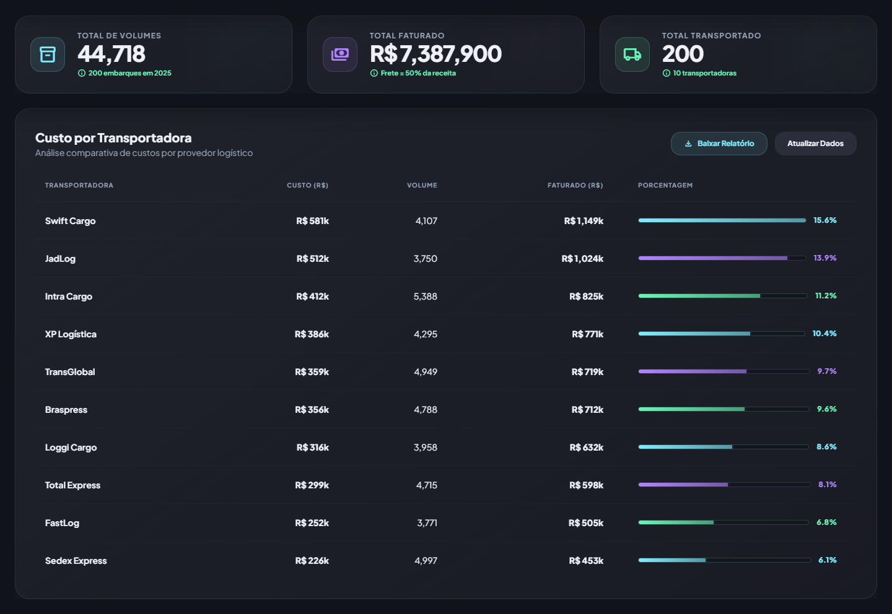
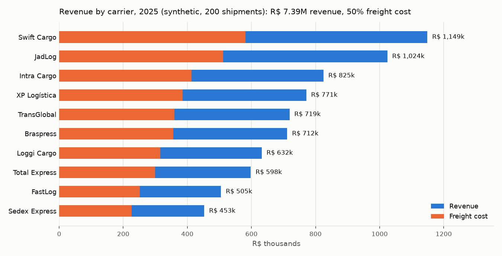

<p align="center">
  
</p>

<p align="center">
  
  
  
</p>

> An executive logistics dashboard: freight revenue, cost, margin, volume and year-to-date figures by carrier, with a map of flows between states. The report is saved in the PBIP text format, so every measure and visual is readable and diffable in git.



<sub>The HTML prototype of the layout (<code>DASH LOGISTICA.html</code>). Every number on it is computed from <code>BASE LOGISTICA.csv</code> by <a href="scripts/build_prototype.py">scripts/build_prototype.py</a>, so it agrees with the Power BI report; the first draft used placeholder values.</sub>

## What is on the dashboard

| Visual | Content |
|---|---|
| KPI cards | Revenue, margin, average ticket, volume transported, revenue YTD, revenue YoY % |
| Map | Origin and destination states (Azure Maps) |
| Carrier chart | Comparison between carriers |
| Monthly chart | Trend over the months |

## DAX

```dax
Faturamento YTD = TOTALYTD([Faturamento Total], 'BASE LOGISTICA'[Data])

Faturamento YoY % =
    VAR fat_atual   = [Faturamento Total]
    VAR fat_ano_ant = CALCULATE([Faturamento Total], SAMEPERIODLASTYEAR('BASE LOGISTICA'[Data]))
    RETURN DIVIDE(fat_atual - fat_ano_ant, fat_ano_ant, 0)

Ticket Médio          = DIVIDE([Faturamento Total], [Volume Total], 0)
Faturamento por Viagem = DIVIDE([Faturamento Total], COUNTROWS('BASE LOGISTICA'), 0)
```

`DIVIDE` with a zero fallback everywhere, so an empty filter shows 0 instead of an error. The step-by-step build (Power Query import, measures, visuals) is in [`DAX_LOGISTICS_GUIDE.md`](DAX_LOGISTICS_GUIDE.md).

## Data

`BASE LOGISTICA.csv` has 200 synthetic shipments from 2025: date, carrier, customer, origin and destination state, volume, revenue and freight cost. Some carrier names are real Brazilian brands used as labels; every value is made up.



<sub>Generated from the CSV by <a href="scripts/chart_revenue_by_carrier.py">scripts/chart_revenue_by_carrier.py</a>, with the same aggregation as the carrier visual in the report. Freight cost sits at about 50% of revenue for every carrier because the synthetic data was generated that way; with real data this is the chart that would show which carriers erode margin.</sub>

## Repository layout

```
LOGISTICA/                     current version of the report (PBIP)
  DASH LOGISTICA.Report/       pages and visuals as JSON
  DASH LOGISTICA.SemanticModel/ tables and DAX measures as TMDL
DASH LOGISTICA.pbix            the same report as a single binary file
DASH LOGISTICA.html            HTML prototype of the dashboard layout, numbers from the CSV
scripts/                       prototype builder and chart, both computed from the CSV
DAX_LOGISTICS_GUIDE.md         build guide
```

Open `LOGISTICA/DASH LOGISTICA.pbip` in Power BI Desktop (PBIP support is enabled by default in current versions).

## Why PBIP

A `.pbix` is a zip: git sees one binary blob and a code review shows nothing. PBIP stores the model as TMDL and the report as JSON, so a changed measure shows up as a one-line diff, and the report can be reviewed like code.

## Limitations

- One flat table plus Power BI's automatic date tables; there is no separate date or carrier dimension yet. A proper star schema is the next step.
- Synthetic data, small on purpose. It covers 2025 only, so the YoY measure returns 0 until a second year is loaded.
- The CSV has a data quality issue that the report does not catch: 11 shipments go to destination state `MD`, which is not a Brazilian state code. A validation step in Power Query (or upstream) should reject or map it.
- The state shapes on the HTML prototype's map are schematic, not real borders.

## Author

**Silvano Moraes de Souza**, Software Engineer · Python, APIs, automation and data in production
[LinkedIn](https://www.linkedin.com/in/silvano-moraes-de-souza) · [Portfolio](https://silvanomsouza.vercel.app/) · [GitHub](https://github.com/silvano-moraes-de-souza)
